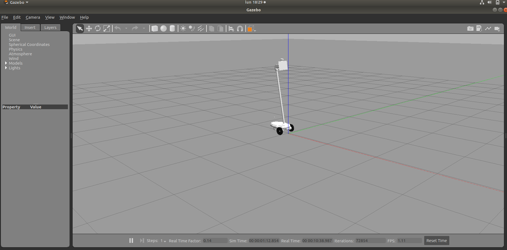
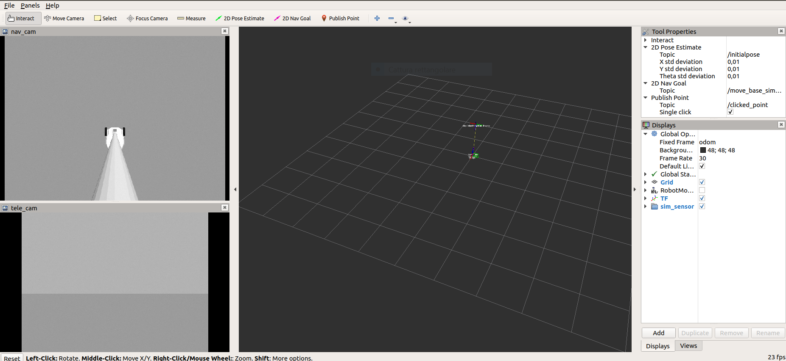
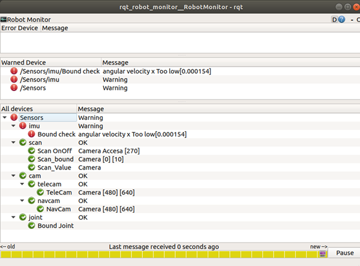
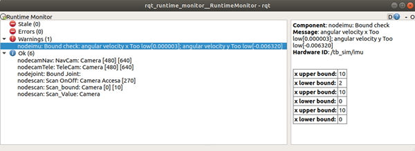

# Diagnostics_Ohmni_Robot-
This is a workspace for Ohmnilabs robot simulation and dignostics.





Currently, in this simulation includes:
* KOLVN office model with texture and material for RGB camera. This model is constructed by Sketchup, adding material and texture mapping using Blender
* Sensor plugins: depth camera, navigation camera, telepresence camera, IMU, laser range sensor
* Actuator plugins: differential drive, neck servo

## Prerequisites
* Ubuntu 18.04
* [ROS Melodic](http://wiki.ros.org/melodic/Installation/Ubuntu) : recommend install ros-melodic-desktop-full
* [Gazebo 9.10.0](http://gazebosim.org/tutorials?tut=install_ubuntu&cat=install#Defaultinstallation:one-liner): Or you could use the default installed version (9.0.0) with the above ROS install. 


## Installation
Open terminal and clone package

```
~..$  git clone https://github.com/nataliamiccini/Diagnostics_Ohmi_Robot-.git-b indigo-devel
```
Install with catkin_make
```
~..$ cd tb-simulation/ros_ws
~../tb-simulation/ros_ws$ catkin_make 
```
```
~$ sudo apt install ros-melodic-gazebo-plugins ros-melodic-rqt-robot-steering ros-melodic-rviz-imu-plugin ros-melodic-joint-state-publisher-gui
```
## Basic Usage
In order to start programs, open a terminal on Ubuntu by right-clicking on the desktop and clicking "Open Terminal".  Once the window opens, type the following commands: 
```
~../tb-simulation/ros_ws$ source devel/setup.bash
~../tb-simulation/ros_ws$ roslaunch diagnostic_updater diagnostic_updater_fast_test.xml
```
Using Rviz to visualize sensor data. Control robot speed (linear and angular) with /tb_cmd_vel, robot neck position with /tb_sim/cmd_pos


